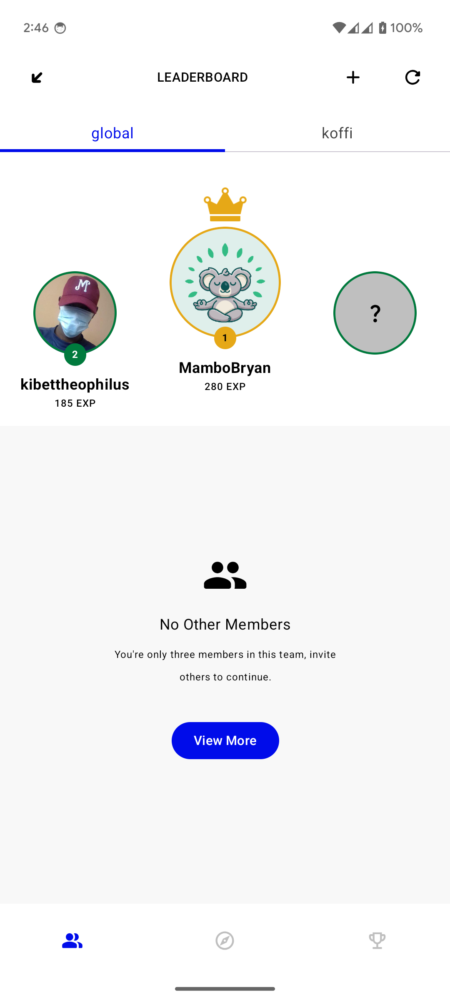
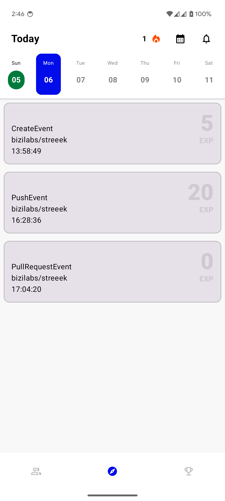
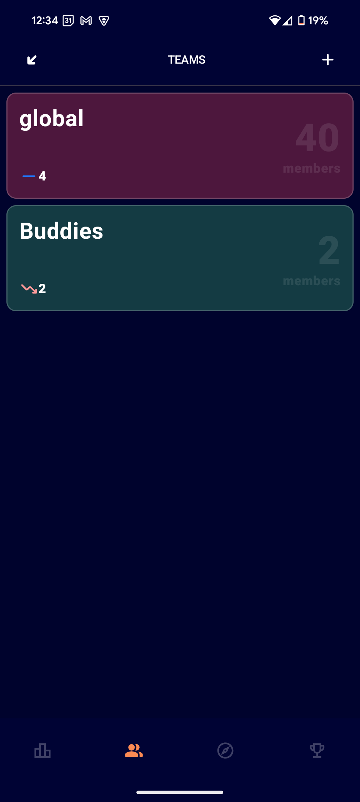
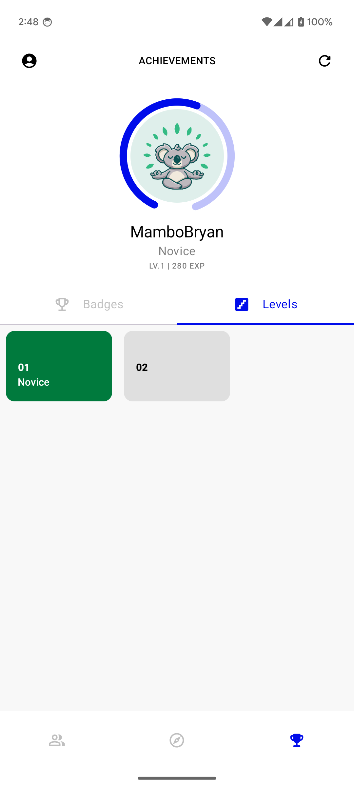

 

# Streeek
   

[Overview](#overview) •
[Features](#features) •
[Screenshots](#screenshots) •
[Contributing](#-contributing)

## Overview
Turn your GitHub contributions into an epic game! Track your progress, earn points for each commit, 
pull request, or issue, and challenge your friends to climb the leaderboard. Stay motivated with 
streaks, unlock achievements, and show off your coding dominance in a fun and competitive way. 
Whether you're collaborating, contributing, or just pushing code, every action takes you closer to 
victory!

## Features

- [x] **Gamified Contribution Tracking**: Earn points for commits, pull requests, issues, and more.
- [x] **Daily Streaks**: Track and maintain your contribution streaks to stay consistent.
- [x] **Leaderboards**: Compete with friends or other developers and climb to the top.
- [x] **Dynamic Levels**: Level up every 500 points and showcase your progress.
- [x] **Profile Overview**: View your total points, streaks, and rank in one place.
- [ ] **Achievements**: Unlock badges and milestones for key GitHub activities.
- [ ] **Reminders**: Get daily nudges to ensure you don’t miss contributing.
- [ ] **Interactive Challenges**: Challenge friends to coding duels for extra points.
- [ ] **Activity Insights**: Visualize your GitHub activity with clear graphs and stats.

Why don't you give it a try? :wink: :wink:

## Screenshots

|                                      Leaderboard                                       |                                      Feed                                       |                                       Teams                                       |                                       Achievements                                       |
|:-----------------------------------------------------------------------------------------:|:-------------------------------------------------------------------------------:|:---------------------------------------------------------------------------------------:|:----------------------------------------------------------------------------------------:|
|  |  |   |   |

## 🤩 Contributing

     

A contributions guideline will be coming soon in the meantime, appreciate the project? For a comprehensive guide on setting up the project, refer to the [setup](docs/SETUP.md) documentation. Happy coding  
Here's how you can help:

- 🌟 Star        : Give it a star at the top right. It means a lot!
- 😎 Contribute  : Found a bug or have a new feature idea? Create an issue [here](https://github.com/bizilabs/streeek/issues/new).
- 💬 Feedback    : Have suggestions and you're not sure? Open an issue or start a discussion.

## ✨ Streeekers

Meet our amazing Streeekers...the minds and hearts keeping Streeek alive with their contributions!💥

<!-- readme: contributors -start -->
<table>
<tr>
    <td align="center">
        <a href="https://github.com/MamboBryan">
            
             
            <b>MamboBryan</b>
        </a>
    </td>
    <td align="center">
        <a href="https://github.com/kibettheophilus">
            
             
            <b>Kibet Theo</b>
        </a>
    </td>
    <td align="center">
        <a href="https://github.com/janewaitara">
            
             
            <b>Jane Waitara</b>
        </a>
    </td>
    <td align="center">
        <a href="https://github.com/bensalcie">
            
             
            <b>Ben Salcie</b>
        </a>
    </td>
    <td align="center">
        <a href="https://github.com/Anniekobia">
            
             
            <b>Annie Kobia</b>
        </a>
    </td>
    <td align="center">
        <a href="https://github.com/ericwafula">
            
             
            <b>Eric Wafula</b>
        </a>
    </td></tr>
<tr>
    <td align="center">
        <a href="https://github.com/selemondev">
            
             
            <b>Selemon Brahanu</b>
        </a>
    </td>
    <td align="center">
        <a href="https://github.com/muth0mi">
            
             
            <b>Oliver Muthomi</b>
        </a>
    </td></tr>
</table>
<!-- readme: contributors -end -->
