# Welcome To Streeek Development

This document provides a detailed guide on how to set up and run the project.
Follow the steps below to ensure a smooth setup process.

In order to setup the project properly we'll need a github app and supabase account

# Table Of Contents
- [Fork & Clone](#fork--clone-) 
  - [Fork Repository](#fork-the-repository) 
  - [Clone Repository](#clone-the-repository) 
- [Create Github App](#create-github-app) 
  - [Navigate to OAuth apps](#navigating) 
  - [Create an OAuth apps](#creating) 
- [Configure Supabase](#configure-supabase-backend-)
  - [Create Account](#create-supabase-account)
  - [Create Organization](#create-supabase-organization)
  - [Create Project](#create-supabase-project)
  - [Create Tables](#create-tables)
  - [Create Materialized Views](#create-materialized-views)
  - [Create Functions](#create-functions)
  - [Create Cron Jobs](#create-cron-jobs)
- [Finally](#android-studio)
- [Android Studio](#android-studio)

## Fork & Clone 
### Fork the Repository

- Navigate to the GitHub repository page.

- Click the Fork button in the top-right section to create a copy of the repository under your GitHub account.

| Fork                                                            | 
|-----------------------------------------------------------------|
| 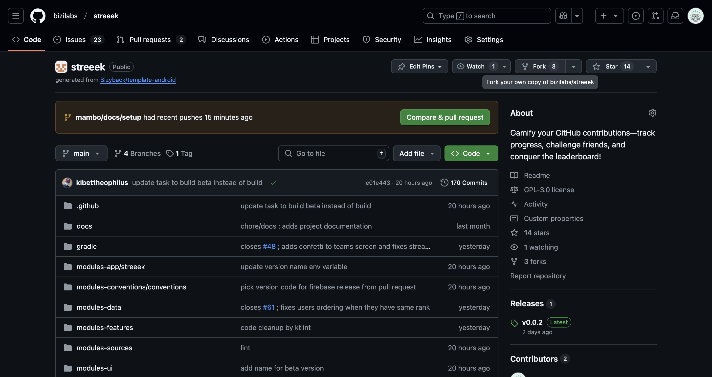 |


### Clone The Repository

- Copy the URL of your forked repository e.g. `https://github.com/<your-username>/<repository-name>.git`.
  - while forking the repository you can change the repository name if you wish :wink:.

- Open a terminal or command prompt and run the following command:

    ```shell
    git clone https://github.com/<your-username>/<repository-name>.git
    ```

- Navigate into the cloned repository directory:
    ```shell
    cd <repository-name>
    ```
- Inside the repository create a `local.properties` file if it's not created.

## Create Github App

Create a github app

### Navigating
- Click on your `profile` image on the top right

| Click Profile                                                            | 
|--------------------------------------------------------------------------|
| 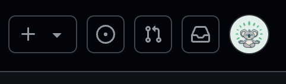 |

- In the pop up sheet that appears click on `settings`

| Click Settings                                                            | 
|---------------------------------------------------------------------------|
| 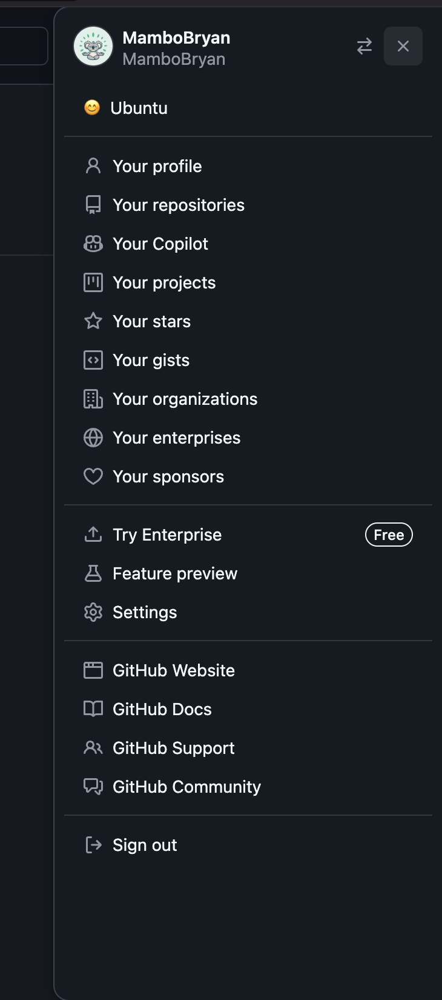 |

- In your settings page click on `developer settings` at the bottom left

| Click Settings                                                                      | 
|-------------------------------------------------------------------------------------|
| 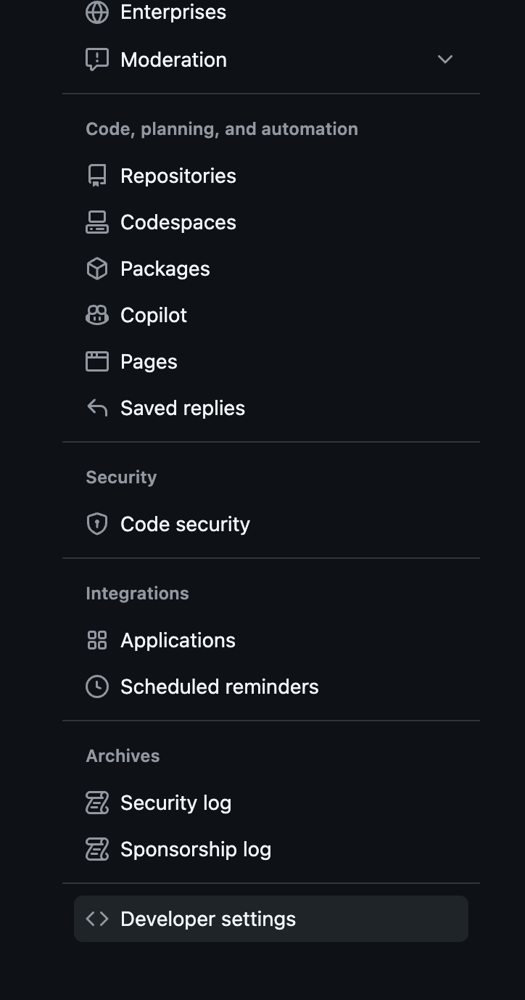 |

- In your `developer settings` page click on `OAuth Apps` & then click on `New OAuth app` action

| Click Settings                                                              | 
|-----------------------------------------------------------------------------|
| 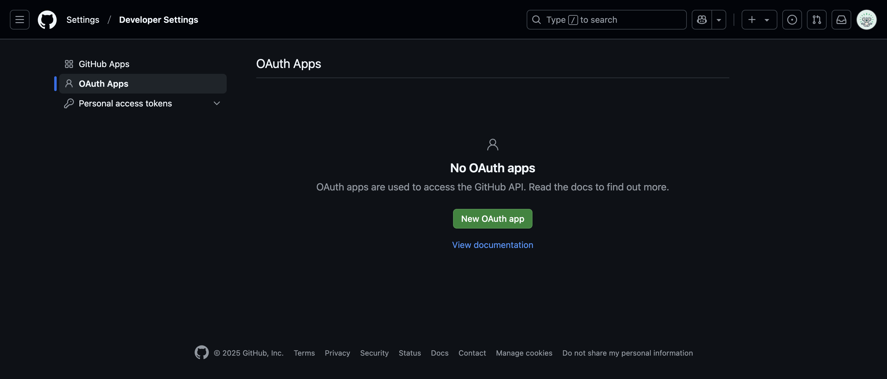 |

### Creating
- Fill the `Register a new OAuth app` with app name, homepage url and description of your choosing and set callback url to <font color="red">`streeek://app.mobile`</font> like in the example below.
> :warning:  **Important:**  Ensure the callback url is : `streeek://app.mobile`.

| Register Application                                                            | 
|---------------------------------------------------------------------------------|
| 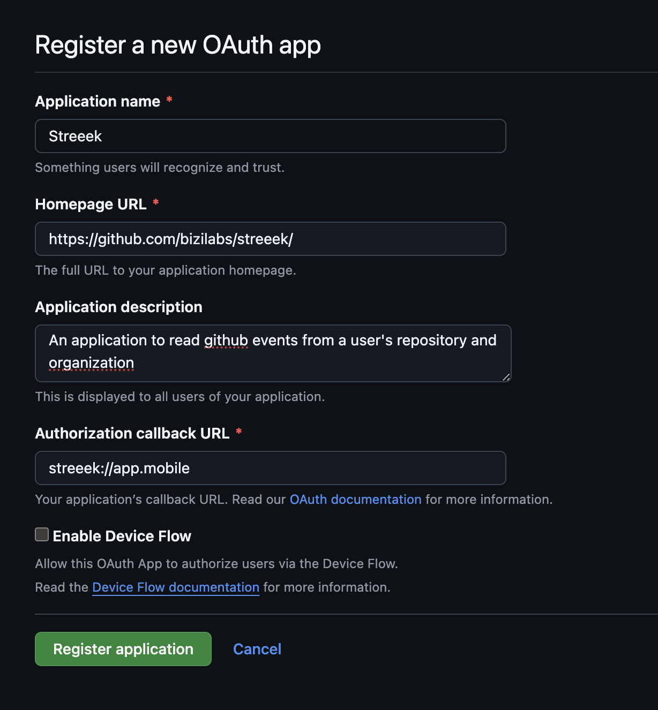 |

- Click on `Register application`
- You'll be presented with your application page where you can update the details and view your `Client ID`

| Application                                                            | 
|------------------------------------------------------------------------|
| 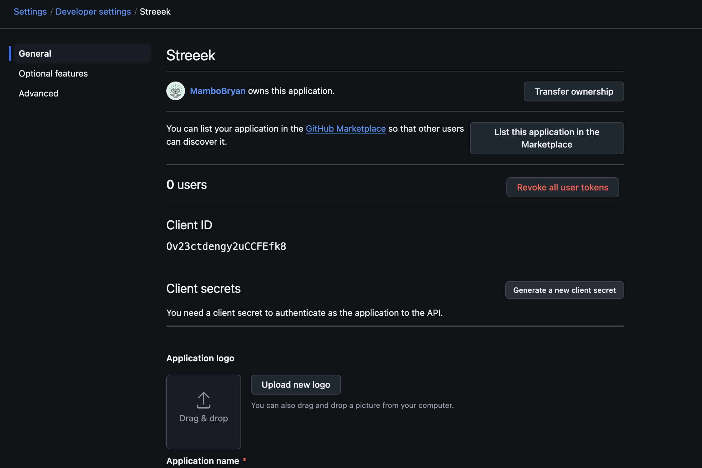 |

- click on `Generate a new client secret` and ensure you save the secret before leaving the page.

| Secrets                                                                  | 
|--------------------------------------------------------------------------|
|  |

- Now that you have created your github app, save the following details in your `local.properties` folder 

    ```properties
    # Declare Github Secrets
    github.client.id=your-github-app-client-id
    github.client.name=your-github-app-name
    github.client.secret=your-github-app-client-secret
    github.client.redirect.url=streeek://app.mobile
    ```

## Configure Supabase Backend  
Streeek uses supabase a BAAS(Backend As A Service) and this section details on how to set it up
> If you already have a supabase account and a project you can skip directly to [creating tables](#create-tables)

### Create Supabase Account
- Go to https://supabase.com/dashboard/sign-up and fill in your email and password and click `Sign Up`
> You can also sign up with Github by clicking `Continue with Github` :wink:

> :warning:  **Important:**  You'll need to confirm your email address before you can use supabase.

| Create Account                                                              | 
|-----------------------------------------------------------------------------|
|  |

### Create Supabase Organization
- After creating an account you'll be prompted to create an organization. Change the organization name and click on `Create organization`
> As for pricing you can use the Free tier for practically everything, but be smart, upgrade to pro :wink: :wink:

| Create Organisation                                                     | 
|-------------------------------------------------------------------------|
| 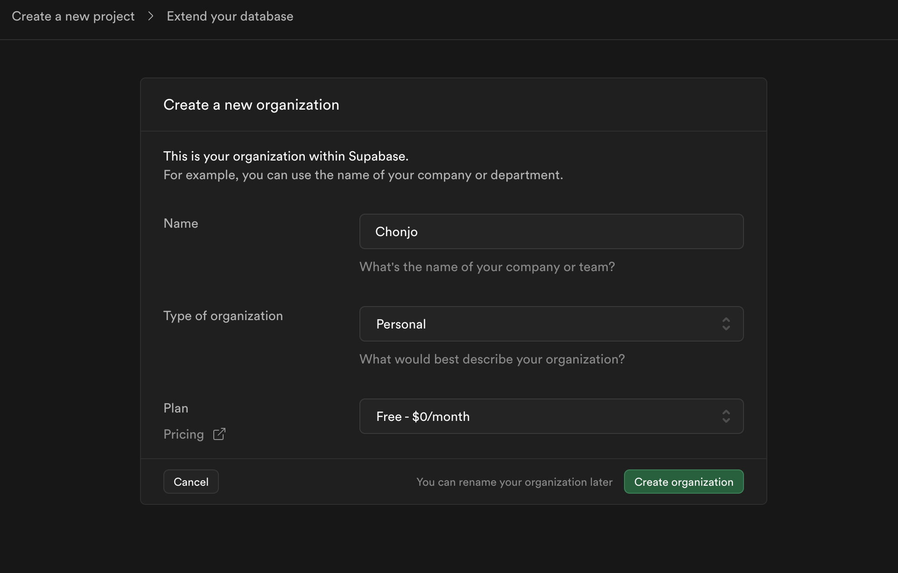 |

### Create Supabase Project
- After creating an organization you'll be prompted to create a project. You can edit the project name, add a database password and change the database region closest to you and click on `Create new project`
> It'll take a few minutes to setup the project.

| Create Project                                                              | 
|-----------------------------------------------------------------------------|
| 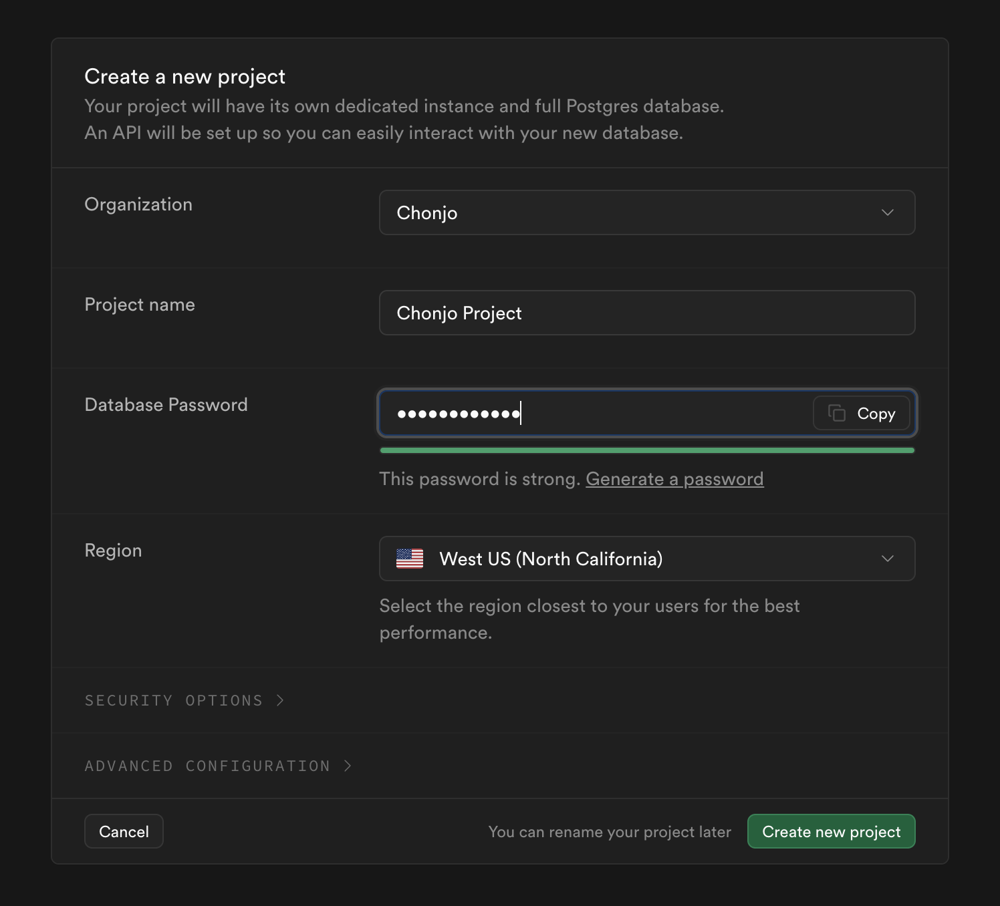 |

- On the project home page click on `SQL Editor` to proceed

| Project Page                                                         | 
|----------------------------------------------------------------------|
| 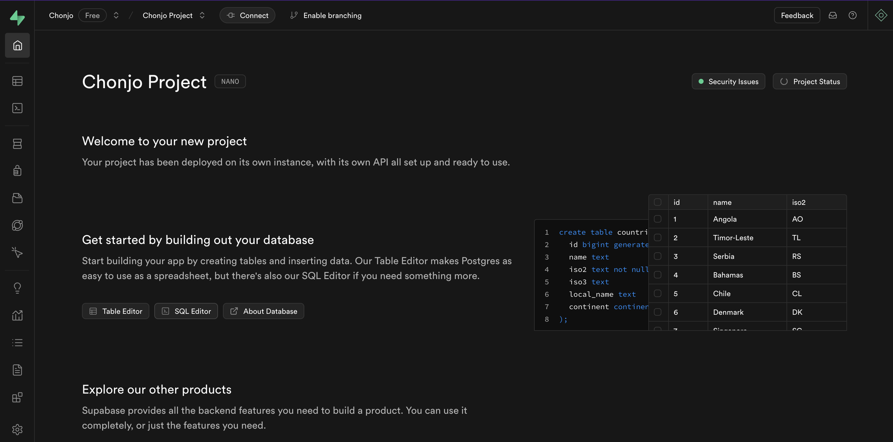 |

### Create Tables
- To create tables enter the following sql query found [here](../.github/images/setup/supabase/sql/create_tables.sql) in the query editor and click on `Run`

| Create Tables                                                              | 
|----------------------------------------------------------------------------|
| 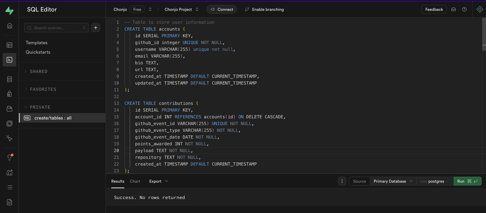 |

### Create Materialized Views
- Click on the plus icon in the top left and `Create a new snippet` to continue
- To create materialized views enter the following sql query found [here](../.github/images/setup/supabase/sql/create_materialized_views.sql) into the new snippet and click on `Run`

| Create Materialized Views                                                 | 
|---------------------------------------------------------------------------|
| 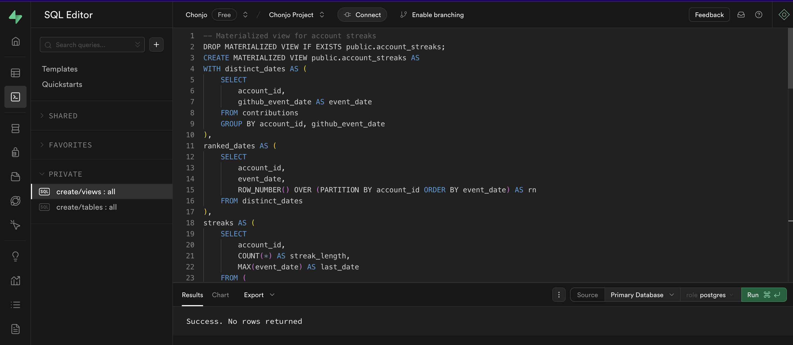 |

### Create Functions
- Click on the plus icon in the top left and `Create a new snippet` to continue
- To create functions enter the following sql query found [here](../.github/images/setup/supabase/sql/create_functions.sql) into the new snippet and click on `Run`

| Create Functions                                                              | 
|-------------------------------------------------------------------------------|
| 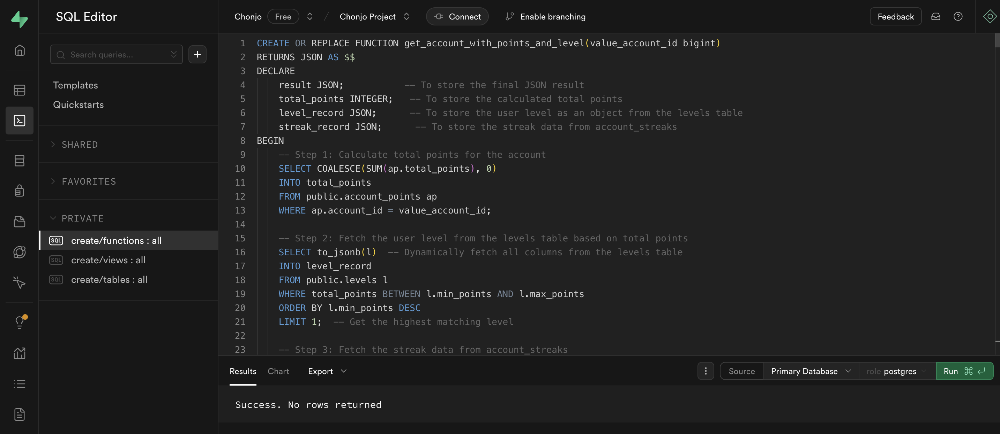 |

### Create Cron Jobs
In order for use to use cron jobs in supabase we need to add it in our project.
- On the left side menu click on `Integrations`

| Navigate to Integrations                                                   | 
|----------------------------------------------------------------------------|
| 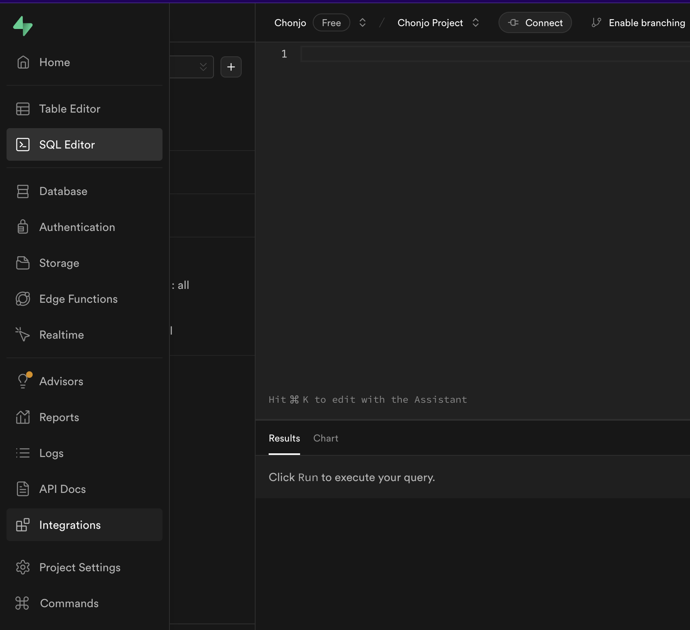 |

- On the integrations screen, type cron in the search bar field & click on the cron item

| Search Cron                                                              | 
|--------------------------------------------------------------------------|
| 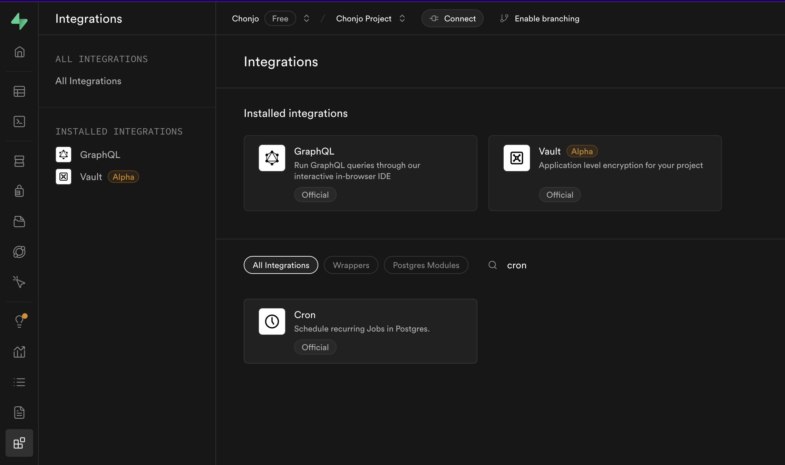 |

- In the cron integration overview, click on `Enable pg_cron`

| Enable Cron                                                              | 
|--------------------------------------------------------------------------|
| 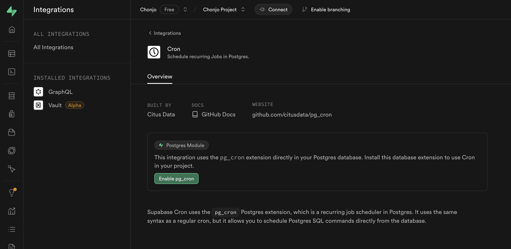 |

- In the dialog pop-up, click on `Enable Extension` to confirm enabling cron jobs extension integration

| Confirm Cron                                                              | 
|---------------------------------------------------------------------------|
| 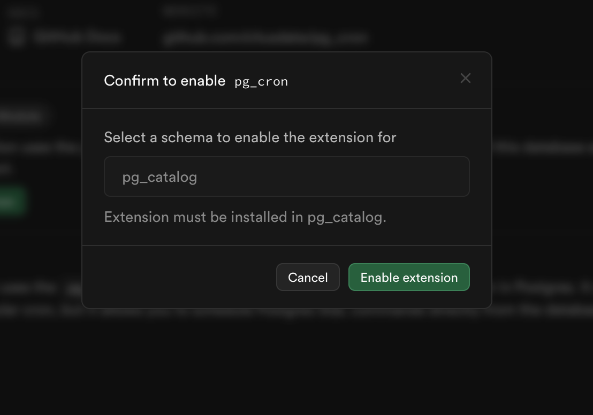 |

- Click on the SQLEditor tab in the left navigation menu to navigate back to the SQLEditor page

| Confirm Cron                                                            | 
|-------------------------------------------------------------------------|
| 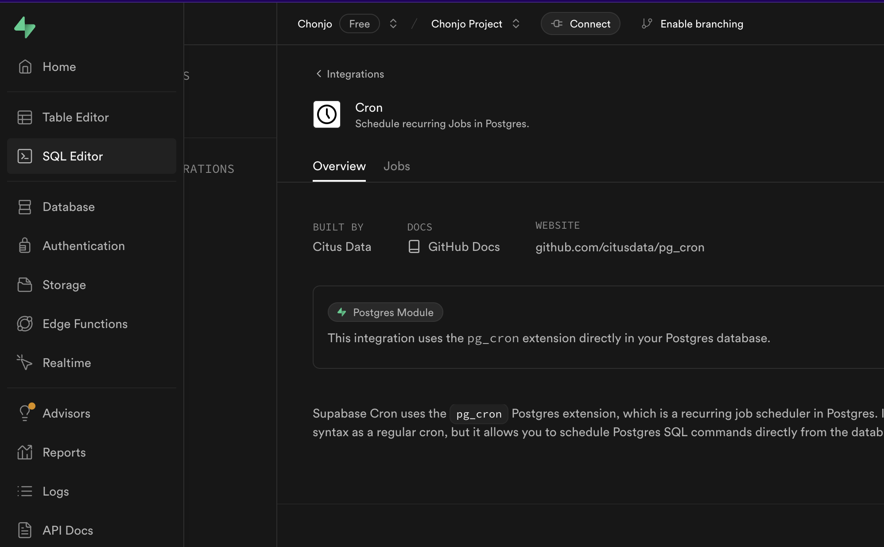 |

- Click on the plus icon in the top left and `Create a new snippet` to continue
- To create cron jobs enter the following sql query found [here](../.github/images/setup/supabase/sql/create_cron_jobs.sql) into the new snippet and click on `Run`

| Create Cron Jobs                                                          | 
|---------------------------------------------------------------------------|
| 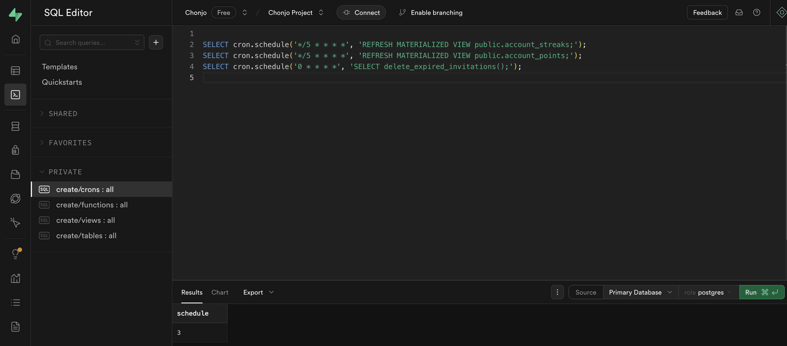 |

- Now that you have fully setup your supabase backend we need the api url and key to continue.
- On the top navigation menu click on `Connect`

| Connect                                                              | 
|----------------------------------------------------------------------|
| 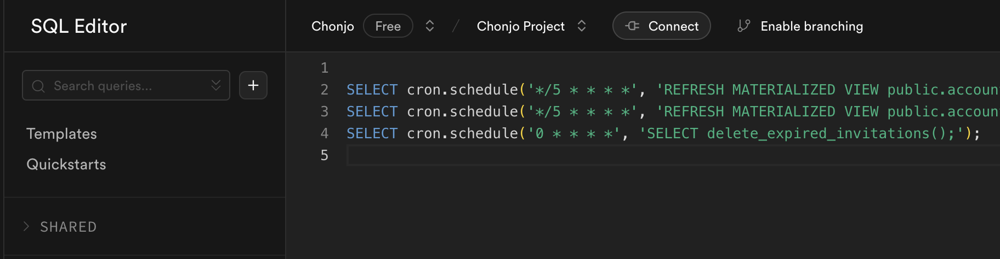 |

- On the pop dialog that appear click on `App Frameworks`

| Connect                                                                             | 
|-------------------------------------------------------------------------------------|
| 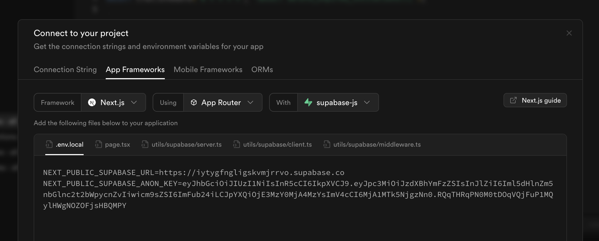 |

- Copy the supabase url & supabase anon key into your `local.properties` file as below

  ```properties
  # Declare Supabase Secrets
  supabase.url=your-supabase-url
  supabase.key=your-supabase-anon-key
  ```

## Android Studio
- Open the project in android studio & sync. You're good to go!

## 🤩 Contributions

A contributions guideline will be coming soon in the meantime >
Appreciate the project? Here's how you can help:

- 🌟 Star        : Give it a star at the top right. It means a lot!
- 😎 Contribute  : Found an issue or have a feature idea? Submit a PR.
- 💬 Feedback    : Have suggestions? Open an issue or start a discussion.
